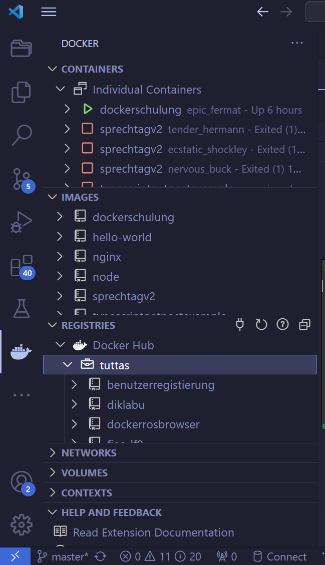
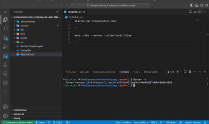

# Anwendungsvirtualisierung mit Docker

... von und mit Dr. Jörg Tuttas

---

<!--
header :  "Anwendungsvirtualisierung mit Docker"
 -->


# Kurzvorstellung (wer / woher)

- Was ist meine Motivation an der Veranstaltung teilzunehmen?
- Dieses wird eine gute Veranstaltung wenn ....

---


## Einführung in Docker (Tag 1)

- Unterschiede zwischen virtuellen Maschinen und Containern
- Installation von Docker
- Image vs. Container
- Grundlegende Befehle
- Erstellen eines eigenen Images

---


## Einführung in Docker (Tag 2)

- Host mit dem Container verbinden
- Exponieren von Ports und Verbinden von Containern
- Umgebungsvariablen
- Volumes
- Docker und Netzwerke
- Die Container Registry
- Orchestrierung von Docker Containern

---


## Einführung in Docker (Tag 3)

- Docker im Kontext von CI/CD
- Entwicklung und Präsentation einer eigenen Lernsituation
- Reflexion

---


## Was ist Containervirtualisierung?

Wir schreiben das Jahr 2012, Sie arbeiten in einem Systemhaus und erhalten folgenden Auftrag!

> "Wir sind ein kleines mittelständiges Unternehmen im Bereich der Automobilzulieferung und wollen unseren Webauftritt mittels **Wordpress** realisieren. Ferner wollen wir unseren Kunden bzw. auch unseren Mitarbeitern Dateien über eine Cloudlösung zur Verfügung stellen. Wir haben uns hier für die Anwendung **Owncloud** entschieden. Wir beauftragen Sie damit uns dieses Anwendungen zur Verfügung zu stellen."

---


## Installation von Docker

- Aktiviren Sie WSL2 auf ihrem Rechner. Dieses geschieht über die Kommandozeile (als Administrator) über:

```cmd
wsl --install
```

- Gehen Sie auf [https://docs.docker.com/desktop/install/windows-install/](https://docs.docker.com/desktop/install/windows-install/) und installieren Sie Docker auf ihren Rechner.

- (*) Erstellen Sie einen Account für sich auf dem Docker Hub ([https://hub.docker.com/](https://hub.docker.com/)) 

---



## VS Code (Docker extension)

VS Code ist ein kostenloser plattformunabhängiger Editor von Microsoft, der mittels Extensions umfangreich erweitert werden kann.

Die Docker Extension für VS Code unterstützt den Entwickler bei allen notwendigen Arbeiten mit Docker.

---


## Play with Docker


[https://labs.play-with-docker.com/](https://labs.play-with-docker.com/)

---


## Codespace



[https://github.com/codespaces/new?hide_repo_select=true&ref=master&repo=695430178&skip_quickstart=true](https://github.com/codespaces/new?hide_repo_select=true&ref=master&repo=695430178&skip_quickstart=true)

---


## Images und Container

Docker ist ein Kommandozeilenanwendung (siehe Docker Cheat Sheet). Im weiteren Verlauf werden wir die wichtigsten Befehle kennen lernen.

### Laden des ersten Images und starten des ersten Containers

```docker
docker run hello-world
```

---


## Images auflisten

Auflisten der aktuell vorhandenen Images.

```docker
docker images
```

---


## Wordpress

In ähnlicher Weise kann nun *Wordpress* gestartet werden, der Parameter **-p 88:80** sorgt dafür, dass der Port 80 auf den Port 88 des Hosts umgeleitet wird.

```docker
docker run -p 88:80 wordpress
```

---


## Wordpress als Deamon

Um nun Wordpress als Deamon (Hintergrundprozess) zu starten dient die **-d** Option.

```docker
docker run -d -p 88:80 wordpress
```

Über .....

```docker
docker ps
```

erhält man Auskunft über die laufenden Container.

---


## Container starten, stoppen und löschen

Stoppen:

```docker
docker stop {id}
```

Starten:

```docker
docker start {id}
```

Löschen:

```docker
docker rm {id}
```

---


## Container benennen

Mittels der Option **--name** können die Container benannt werden. Dann kann der Docker Container über Angabe des Namens, statt der ID gestartet, gestoppt und gelöscht werden.


```docker
docker run -p 88:80 -d --name wp wordpress
```

---


## Ein eigenes Image bauen (1)

Im folgenden soll eine Webseite (im Verzeichnis **html**) durch einen eigenen Docker Container ausgeliefert werden.

```html

<!DOCTYPE html>
<html>
<head>
    <meta charset='utf-8'>
    <meta http-equiv='X-UA-Compatible' content='IE=edge'>
    <title>Hello World</title>
    <meta name='viewport' content='width=device-width, initial-scale=1'>    
</head>
<body>
    <h1>Hallo Welt</h1>
</body>
</html>

```

---


## Ein eigenes Image bauen (2)

Erzeugen Sie im Verzeichnis **html** eine Datei **Dockerfile** mit folgendem Inhalt.

```dockerfile

FROM nginx:latest
COPY index.html /usr/share/nginx/html/index.html

```

Und bauen Sie das Image via des Befehls:

```docker

docker build -t meinimage.

```

---


## Ein eigenes Image bauen (3)

Anschließend kann aus dem Image ein Container erzeugt werden.

```docker

docker run -p 88:80 -d meinimage

```

Durch den Aufruf von *http://localhost:88* sollte der Webserver erreichbar sein.

---


## Mit Containers verbinden

Verbinden mit STD-Out des Containers:

```docker
docker attach {id}
```

Starten von BASH:

```docker
docker exec -it <mycontainer> bash
```


---


## Ein Image speichern / veröffentlichen (1)

Auf dem Docker Hub können eigene Images gespeichert / veröffentlicht werden. Dazu muss man sich zunächst auf dem Docker Hub anmelden:

```docker

docker login -u {Benutzername}

```

---


## Ein Image speichern / veröffentlichen (2)

Das Image muss für den Docker Hub besonders benannt werden und zwar {Benutzername}/{Imagename}[:tag], wobei der "tag" optional ist. Anschließend kann das Image veröffentlicht werden:

```docker

docker push {Benutzername}/{Imagename}[:tag]

```

---


## **Aufgabe:** </br> Ein php Image erstellen und veröffentlichen

Im Verzeichnis **src** befindet sich u.a. die untere Datei **index.php** erstellen Sie ein Docker Image und veröffentlichen Sie dieses auf dem Docker Hub.

```php

<?php
echo "Hallo Welt";
?>

```

---


## **Lösung:** </br> Ein php Image erstellen und veröffentlichen


```docker

# Verwende den offiziellen PHP-Basisimage mit Apache-Server
FROM php:7.4-apache

# Kopiere die Dateien deines PHP-Projekts in das Containerverzeichnis /var/www/html
COPY src/* /var/www/html/


```

---


## Einen MySQL Server erstellen

Das folgende Dockerfile erstellt ein neues MYsql Image, vergibt Benutzer-Credentials und legt eine Datenbank **DB.sql** an. 

```docker
FROM mysql:latest
ENV MYSQL_DATABASE=verkauf
ENV MYSQL_USER=user
ENV MYSQL_PASSWORD=geheim
ENV MYSQL_ROOT_PASSWORD=geheim
COPY DB.sql /docker-entrypoint-initdb.d/
```

Starten des Containers via:

```docker
docker run -d -p 3306:3306 {Name des Images}
```

---


## Verbinden mit dem MySQL Server

Anschließend kann man sich mit dem MySQL Server verbinden. Der Server ist über **localhost** zu erreichen und der Benutzername lautet **user** und das Kennwort **geheim**, der Name der  Datenbank lauten **verkauf**.

Idealer Weise verwendet man dazu eine MySql Extension von VS Code.

---


## Volumes (1)

Ergänzen Sie das Docker File um folgende Anweisung.

```docker
VOLUME /var/lib/mysql

```

Damit wichtige Daten (wie z.B. die einer Datenbank) erhalten bleiben, müssen sie außerhalb des Containers geladen werden. Dazu dienen **Volumes** auf dem Docker-Host. 

---


## Volumes (2)

Auf dem Host kann ein Volume wie folgt erzeugt werden.

```docker
docker volume create {volumename}
```

Anschließend kann der Docker Container wie folgt gestartet werden:

```docker
docker run -d -p 3306:3306 -v {volumename}:/var/lib/mysql {Name des Images}
```
---


## Volumes (3)

Alle Volumes des Host können wie folgt abgefragt werden:

```docker
docker volume ls
```

Der Speicherort des Volumes kann wie folgt abgefragt werden: 

```docker
docker volume inspect {volumename}
```

Ein Volume löschen geht wir folgt:

```docker
docker volume rm {volumename}
```
